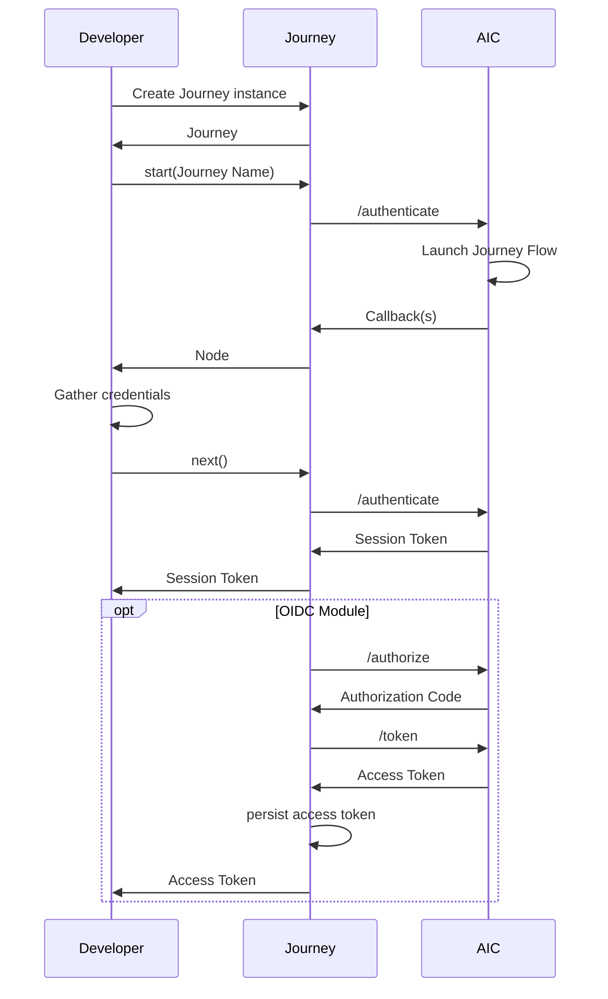
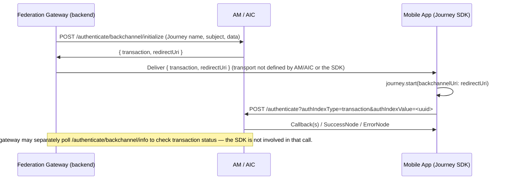
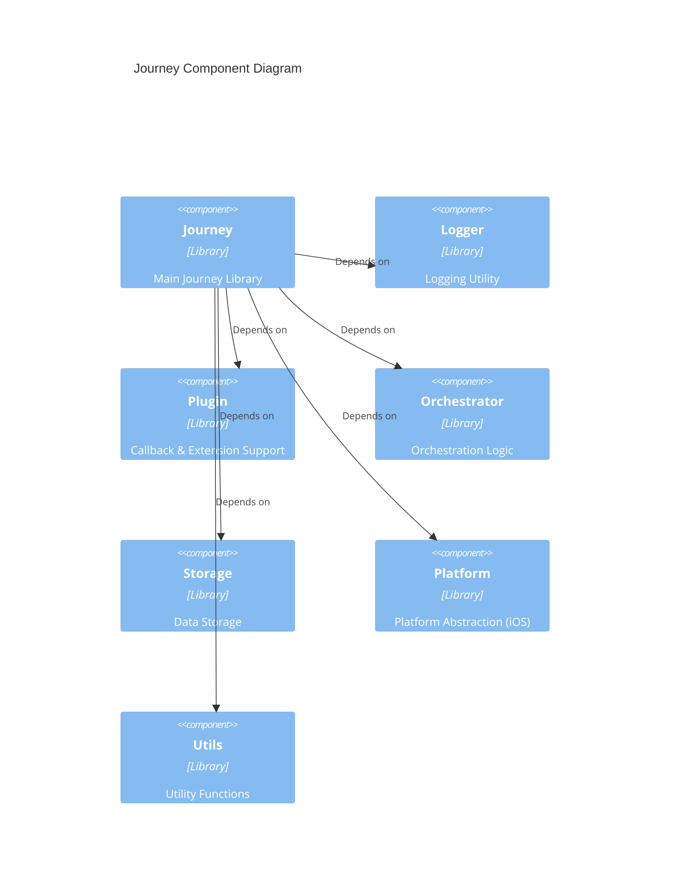

[](https://swift.org)
[](https://developer.apple.com/ios/)
[](../LICENSE)


# PingJourney

Journey is an iOS module designed to streamline Authentication and Authorization processes for applications utilizing Ping Advanced Identity Cloud and PingAM.

## Getting Started

### Prerequisites

- Ping Advanced Identity Cloud / PingAM [Supported Versions](https://support.pingidentity.com/s/article/Ping-Identity-EOL-Tracker)
- iOS 16.0+
- Swift 6.0+
- Xcode 15+

### Installation

To integrate the module into your iOS project, add the following dependency to your `Package.swift` or `Podfile` file.

**Note:** PingJourney depends on `PingOrchestrate` which will be automatically installed.

#### Swift Package Manager

```swift
dependencies: [
    .package(url: "https://github.com/ForgeRock/ping-ios-sdk.git", from: "<version>")
]
```

Then add the `PingJourney` product to your target's dependencies.

#### CocoaPods

```ruby
pod 'PingJourney', '~> <version>'
```

### Import the Module

```swift
import PingJourney
```

## Overview

**Journey** is a robust and adaptable library designed to streamline Authentication and
Authorization processes within your iOS applications. Engineered for ease of integration and
extensibility, it offers a straightforward API to manage authentication flows and handle the various
states encountered during this process.



For a deeper understanding of PingOne AIC Journeys, refer to the official documentation available
[here](https://docs.pingidentity.com/pingoneaic/latest/realms/journeys.html).

## Usage

### Basic Usage

To begin using the `Journey` class, instantiate it within your code, providing a configuration block
to customize its
behavior. This configuration allows you to set parameters such as network timeout and logging
preferences.

Here's a basic example of creating a `Journey` instance and initiating the authentication flow:

```swift
let journey = Journey.createJourney { config in
              config.serverUrl = "https://openam-sdks.forgeblocks.com/am"
          }
var node = journey.start("login") // Start the login authentication flow. Pass the Journey name
if let current = node as? ContinueNode {
    let next = await current.next() // Continue to the next step
}
```

### Integrating the OIDC Module

Optionally, you can enhance the `Journey` instance with the `oidc` module. This module enables the
discovery of OpenID
Connect (OIDC) endpoints using the `discoveryEndpoint` attribute.

```swift
let journey = Journey.createJourney { config in
            // Oidc as module
            config.module(PingJourney.OidcModule.config) { oidcValue in
                oidcValue.clientId = "test"
                oidcValue.discoveryEndpoint = "https://your_openam_domain/am/oauth2/alpha/.well-known/openid-configuration"
                oidcValue.scopes = ["openid", "email", "address"]
                oidcValue.redirectUri = "org.forgerock.demo://oauth2redirect"
                // Add other OIDC configurations as needed
            }
          }
```

### Advanced Journey Configuration

The `Journey` configuration block offers further customization options:

```swift
let journey = Journey.createJourney { config in
            config.timeout = 30 // Network request timeout in seconds (default: 30s)
            config.logger = LogManager.standard // Use the standard logger for output
            config.realm = "<realm_name>" // Specify the realm for authentication
            config.cookie = "<cookie_name>" // Specify the cookie name for session management
            config.module(PingJourney.OidcModule.config) { oidcValue in
                oidcValue.clientId = "test"
                oidcValue.discoveryEndpoint = "https://your_openam_domain/am/oauth2/alpha/.well-known/openid-configuration"
                oidcValue.scopes = ["openid", "email", "address"]
                oidcValue.redirectUri = "org.forgerock.demo://oauth2redirect"
                // Add other OIDC configurations as needed
            }
          }
```

### Pushed Authorization Requests (PAR)

Journey supports [Pushed Authorization Requests (RFC 9126)](https://datatracker.ietf.org/doc/html/rfc9126). When enabled, authorization parameters are sent to the server via a secure back-channel POST before the authorization redirect, improving security by keeping sensitive parameters out of the URL.

```swift
let journey = Journey.createJourney { config in
            config.serverUrl = "https://openam-sdks.forgeblocks.com/am"
            config.module(PingJourney.OidcModule.config) { oidcValue in
                oidcValue.clientId = "test"
                oidcValue.discoveryEndpoint = "https://your_openam_domain/am/oauth2/alpha/.well-known/openid-configuration"
                oidcValue.scopes = ["openid", "email", "address"]
                oidcValue.redirectUri = "org.forgerock.demo://oauth2redirect"
                oidcValue.par = true // Enable Pushed Authorization Requests
            }
          }
```

The PAR endpoint is discovered automatically from the OpenID configuration. If the server does not advertise a `pushed_authorization_request_endpoint`, the SDK falls back to the standard authorization flow.

### Device Authorization Grant — approving device (RFC 8628)

When this device is acting as the *approving* device for an [RFC 8628](https://datatracker.ietf.org/doc/html/rfc8628) device-flow request initiated elsewhere (e.g., a smart TV), pass the `verificationUriComplete` URL into `start(_:configure:)`. After the user authenticates through the Journey flow, the `OidcModule` extracts the `user_code` from the URL and POSTs it (with `decision=allow` and the SSO token as cookie) to that URL, approving the requesting device.

```swift
let node = await journey.start("Login") { options in
    options.verificationUriComplete = URL(string: verificationUriCompleteString)
}
```

`verificationUriComplete` is the URL returned in the `verification_uri_complete` field of the requesting device's `DeviceAuthorizationResponse` — typically scanned from a QR code or pasted by the user. Approval happens transparently in `OidcModule.success` after Journey authentication completes; the requesting device then receives its access token via its own polling loop.

When `verificationUriComplete` is not set, the `OidcModule` proceeds with normal user-delegate setup and no approval POST is made. The cookie name used for the approval POST is taken from `JourneyConfig.cookie`.

### Backchannel Authentication (AM/AIC Transactional Auth)

AM/AIC supports a server-initiated, transactional [backchannel authentication](https://docs.pingidentity.com/pingoneaic/am-authentication/backchannel-authentication.html) flow: a federation gateway calls AM's `/authenticate/backchannel/initialize` endpoint to start a transaction on behalf of the user, and AM responds with a `redirectUri`. The gateway forwards that `redirectUri` to the app, and the app passes it to `journey.start(backchannelUri:configure:)`, which drives the resulting Journey to completion just like any other `start()` call. This flow is distinct from OIDC CIBA and from AM's push-notification MFA — it is AM/AIC's own transactional backchannel mechanism, and only that mechanism is covered here.



```swift
// redirectUri is the value the gateway forwarded to the app, e.g.:
// https://<tenant>/am/UI/Login?realm=%2Falpha&authIndexType=transaction&authIndexValue=<uuid>
let redirectUri = URL(string: gatewaySuppliedRedirectUri)!

let node = await journey.start(backchannelUri: redirectUri) { options in
    options.noSession = false
    options.forceAuth = false
}
```

`start(backchannelUri:configure:)` only reads the `authIndexType` and `authIndexValue` query parameters off `redirectUri` — the URI's path and `realm` query parameter (if present) are ignored. The URI's host is validated: it must match `JourneyConfig.serverUrl`'s host (case-insensitively), otherwise `start(backchannelUri:)` returns a `FailureNode(400, ...)` without making any network call. The authenticate request is always sent to `JourneyConfig.serverUrl` + `JourneyConfig.realm`; the SDK never calls the `redirectUri` itself, which typically points at a browser login page rather than an API endpoint. Both `authIndexType` and `authIndexValue` must be present in the URI's query string **and** non-empty, or `start(backchannelUri:)` returns a `FailureNode(400, ...)` without making any network call — the same is true if `JourneyConfig` is missing.

The resulting `Node` is one of the same four types described in "Navigating the Authentication Flow" below: a `ContinueNode` if the Journey needs more input, a `SuccessNode` on completion, a `FailureNode` for the SDK-side validation errors above, or an `ErrorNode` if AM rejects the transaction (for example, an expired, not-found, or already-completed transaction) — `errorNode.message` carries AM's `message` field from the 4xx response.

**AM/AIC configuration.** This document only covers the iOS SDK side; walking through the AM/AIC admin console is out of scope here. At minimum, the server side needs:

- A confidential OAuth 2.0 client for the federation gateway, with the `Client Credentials` grant enabled and the `back_channel_authentication` scope added to the realm's OAuth2 Provider client-registration scope allowlist.
- A target Journey (e.g. `Login`) for AM to run when the transaction starts.

See [Backchannel authentication](https://docs.pingidentity.com/pingoneaic/am-authentication/backchannel-authentication.html) and [Authenticate endpoint parameters](https://docs.pingidentity.com/pingoneaic/am-authentication/authenticate-endpoint-parameters.html) for the full server-side configuration and the gateway-side REST contract (`/authenticate/backchannel/initialize`, which the gateway calls to obtain the `redirectUri`) — none of which this SDK calls directly.

**Obtaining the `redirectUri`.** In production, the federation gateway is expected to deliver the `{transaction, redirectUri}` payload to the app through whatever channel the gateway integration provides — neither AM/AIC's documentation nor this SDK defines that transport. Today, the `PingExample` sample app only demonstrates this flow with a screen where the `redirectUri` is manually pasted in; there is no deep link, universal link, or push-notification handler wired up in this repository to receive it automatically.

### Navigating the Authentication Flow

The `start()` method initiates the authentication journey and returns a `Node` instance,
representing the current state
of the process. You can then use the `next()` method (available on `ContinueNode`) to transition to
the subsequent
state.

The `resume(uri)` method enables the continuation of an authentication flow after you've obtained a
resume URI, for
instance, through an Email Suspend Node.

Optionally, you can provide options when starting the journey, such as `forceAuth` and `noSession`

```swift
let journey = Journey.createJourney { config in
              config.serverUrl = "https://openam-sdks.forgeblocks.com/am"
              config.realm = "alpha" 
              config.cookie = "386c0d288Bac4b9"
          }

let node = await journey.start("Login") { options in
            options.forceAuth = false
            options.noSession = false
        } // Initiate the authentication journey

// Determine the type of the current Node
switch node {
case let continueNode as ContinueNode:
    // Proceed to the next step in the authentication journey
    let nextNode = continueNode.next()
case let errorNode as ErrorNode:
    // Handle server-side errors (e.g., invalid credentials)
    let errorMessage = errorNode.message
    let input = errorNode.input // Access the raw JSON response with the input attribute
    // Display error to the user
case let failureNode as FailureNode:
    // Handle unexpected errors (e.g., network issues, unexpected errors like parsing response)
    let errorCause = failureNode.cause
    // Log the error and potentially display a generic message
case let successNode as SuccessNode:
    // Authentication successful, retrieve the session
    let session = successNode.session
    let input = successNode.input // Access the raw JSON response with the input attribute
    // Proceed with post-authentication actions
default:
    break
}
```

The `Node` class represents various states within the authentication journey:

| Node Type    | Description                                                                                                                                     |
|--------------|:------------------------------------------------------------------------------------------------------------------------------------------------|
| ContinueNode | Indicates a step in the middle of the authentication journey. Call `node.next()` to advance to the next node.                                   |
| ErrorNode    | Represents a bad request from the server, such as invalid credentials (password, OTP, username). Access the error message using `node.message`. |
| FailureNode  | Signifies an unexpected error during the process, like network connectivity issues. Retrieve the underlying cause using `node.cause`.           |
| SuccessNode  | Indicates successful authentication. Obtain the user session details using `node.session`.                                                      |

### Providing User Input

When the current `Node` is a `ContinueNode`, it often contains a list of `callbacks` that require
user input. You can
access these callbacks using `node.callbacks()` and provide the necessary information to each
relevant callback.

The following Callbacks will be supported in the Core Journey Module:

| Callback Name                   | Callback Description                                                                                |
|---------------------------------|-----------------------------------------------------------------------------------------------------|
| BooleanAttributeInputCallback   | Collects true or false.                                                                             |
| ChoiceCallback                  | Collects single user input from available choices, retrieves selected choice from user interaction. |
| ConfirmationCallback            | Retrieve a selected option from a list of options.                                                  |
| ConsentMappingCallback          | Prompts the user to consent to share their profile data.                                            |
| HiddenValueCallback             | Returns form values that are not visually rendered to the end user.                                 |
| KbaCreateCallback               | Collects knowledge-based answers. For example, the name of your first pet.                          |
| MetadataCallback                | Injects key-value metadata into the authentication process.                                         |
| NameCallback                    | Collects a username.                                                                                |
| NumberAttributeInputCallback    | Collects a number.                                                                                  |
| PasswordCallback                | Collects a password or one-time pass code.                                                          |
| PollingWaitCallback             | Instructs the client to wait for the given period and resubmit the request.                         |
| StringAttributeInputCallback    | Collects the values of attributes for use elsewhere in a tree.                                      |
| SuspendedTextOutputCallback     | Pause and resume authentication, sometimes known as "magic links".                                  |
| TextInputCallback               | Collects text input from the end user. For example, a nickname for their account.                   |
| TextOutputCallback              | Provides a message to be displayed to a user with a given message type.                             |
| TermsAndConditionsCallback      | Collects a user's acceptance of the configured Terms & Conditions.                                  |
| ValidatedCreatePasswordCallback | Collects a password value with optional password policy validation.                                 |
| ValidatedCreateUsernameCallback | Collects a username value with optional username policy validation.                                 |

Here's how to access and populate the callbacks:

```swift
if let current = node as? ContinueNode {
      current.callbacks.forEach { callback in
          switch callback {
           case let nameCallback as NameCallback:
              nameCallback.name = "Your Username"
          case let passwordCallback as PasswordCallback:
              passwordCallback.password = "Your Password"
              // Handle other callback types as they are introduced
          default:
              break
          }
     }
}

// Proceed to the next Node with the provided input
let nextNode = current.next()
```

Each specific callback type provides its own properties for accessing labels and setting values.

#### NameCallback

```swift
let prompt = (callback as? NameCallback)?.prompt // Access the prompt/label
(callback as? NameCallback)?.name = "Your Input" // Set the user's input
```

#### PasswordCallback

`PasswordCallback` offers similar properties to `NameCallback`:

```swift
let prompt = (callback as? PasswordCallback)?.prompt // Access the prompt/label
(callback as? PasswordCallback)?.password = "Your Secret" // Set the user's password
```

### Handling Errors

The Journey SDK distinguishes between `FailureNode` and `ErrorNode` for different types of errors
encountered during the
authentication flow.

A `FailureNode` indicates an unexpected issue that prevents the journey from continuing. This could
stem from network
problems, data parsing errors, or internal SDK issues. In such cases, you can access the underlying
`Error` that
caused the error using `node.cause`. It's generally recommended to display a user-friendly generic
error message and
log the details for support investigation.

An `ErrorNode`, on the other hand, signifies an error response from the authentication server (
typically an HTTP 4xx or
5xx status code). These errors often relate to invalid user input or issues on the server side. You
can retrieve the
specific error message provided by the server using `node.message` and access the raw JSON
response via `node.input`.

```swift
let node = journey.start() // Initiate the authentication flow

switch node {
case let continueNode as ContinueNode:
    // ...
    break
case let errorNode as ErrorNode:
    let errorMessage = errorNode.message // Retrieve the server-provided error message
    let rawResponse = errorNode.input // Access the raw JSON error response
    // Display the specific error message to the user
case let failureNode as FailureNode:
    let errorCause = failureNode.cause // Retrieve the underlying error
    // Log the errorCause for debugging
    // Display a generic error message to the user
case let successNode as SuccessNode:
    // ...
    break
default:
    break
}
```

### Integration with SwiftUI

For applications using SwiftUI, you can seamlessly integrate the Journey SDK using an
`ObservableObject` to manage the
UI state.

#### ViewModel

```swift
@MainActor
class JourneyViewModel: ObservableObject {
    /// Published property that holds the current state node data.
    @Published public var state: JourneyState = JourneyState()
    /// Published property to track whether the view is currently loading.
    @Published public var isLoading: Bool = false
    
    var journey: Journey
    
    /// Initializes the view model and starts the Journey orchestration process.
    init() {
        Task {
            await startJourney()
        }
    }
    
    public func initializeJourney() {
        journey = Journey.createJourney { config in
            let currentConfig = ConfigurationManager.shared.currentConfigurationViewModel
            config.serverUrl = currentConfig?.serverUrl
            config.realm = currentConfig?.realm ?? "root"
            config.cookie = currentConfig?.cookieName ?? ""
            config.module(PingJourney.OidcModule.config) { oidcValue in
                oidcValue.clientId = currentConfig?.clientId ?? ""
                oidcValue.scopes = Set<String>(currentConfig?.scopes ?? [])
                oidcValue.redirectUri = currentConfig?.redirectUri ?? ""
                oidcValue.discoveryEndpoint = currentConfig?.discoveryEndpoint ?? ""
            }
        }
    }
    
    /// Starts the Journey orchestration process.
    /// - Sets the initial node and updates the `data` property with the starting node.
    public func startJourney() async {
        
        await MainActor.run {
            isLoading = true
        }
        
        let next = await journey.start("Login") { options in
            options.forceAuth = false
            options.noSession = false
        }
        
        await MainActor.run {
            self.state = JourneyState(node: next)
            isLoading = false
        }
    }
    
    /// Advances to the next node in the orchestration process.
    /// - Parameter node: The current node to progress from.
    public func next(node: Node) async {
        await MainActor.run {
            isLoading = true
        }
        if let current = node as? ContinueNode {
            // Retrieves the next node in the flow.
            let next = await current.next()
            await MainActor.run {
                self.state = JourneyState(node: next)
                isLoading = false
            }
        }
    }
    
    public func refresh() {
        state = JourneyState(node: state.node)
    }
}
```

#### View (SwiftUI)

```swift
import SwiftUI

struct JourneyView: View {
    /// The view model that manages the Davinci flow logic.
    @StateObject private var journeyViewModel = JourneyViewModel()
    /// A binding to the navigation stack path.
    @Binding var path: [String]
    
    var body: some View {
        ZStack {
            ScrollView {
                VStack {
                    Spacer()
                    // Handle different types of nodes in the Journey.
                    switch journeyViewModel.state.node {
                    case let continueNode as ContinueNode:
                        // Display the callback view for the next node.
                        CallbackView(journeyViewModel: journeyViewModel, node: continueNode)
                    case let errorNode as ErrorNode:
                        // Handle server-side errors (e.g., invalid credentials)
                        // Display error to the user
                        ErrorNodeView(node: errorNode)
                        if let nextNode = errorNode.continueNode {
                            CallbackView(journeyViewModel: journeyViewModel, node: nextNode)
                        }
                    case let failureNode as FailureNode:
                        ErrorView(message: failureNode.cause.localizedDescription)
                    case is SuccessNode:
                        // Authentication successful, retrieve the session
                        VStack{}.onAppear {
                            path.removeLast()
                            path.append("Token")
                        }
                    default:
                        EmptyView()
                    }
                }
            }
        }
    }
}
```

### Post Authentication Operations

After successful authentication using the `Oidc` module, the user's session information is typically
stored securely.
The `Journey` instance provides methods to interact with this stored session.

```swift
// Retrieve the existing user session. If an active session cookie exists, 'user' will not be nil.
// Note: Even if a user object is retrieved, the access and refresh tokens within might be expired.
func accessToken() async {
    let token: Result<Token, OidcError>?
    let journeyUser = await journey.journeyUser()
    token = journeyUser.token()
  
    switch token {
    case .success(let token):
        await MainActor.run {
            self.token = String(describing: token)
            let accessToken = token.accessToken
        }
        LogManager.standard.i("AccessToken: \(self.token.accessToken)")
    case .failure(let error):
        await MainActor.run {
            self.token = "Error: \(error.localizedDescription)"
        }
        LogManager.standard.e("", error: error)
    case .none:
        break
    }
}

journeyUser.revoke() // Revoke the current access and refresh tokens
journeyUser.userinfo() // Fetch user information using the access token (if valid)
journeyUser.logout() // Initiate the logout process, potentially clearing local session data
```

### Journey Module Dependencies

The `Journey` module is composed of several foundational components, each responsible for a specific aspect of the SDK's functionality:



### Journey's Callback Customization & Extension

Callbacks below will be supported by other modules:

| Callback Name                    | Callback Description                                                           |
|----------------------------------|--------------------------------------------------------------------------------|
| AppIntegrity                     | Collects a generated token from the client to verify the integrity of the app  |
| DeviceBinding                    | Cryptographically bind a mobile device to a user account.                      |
| DeviceProfileCallback            | Collects meta and/or location data about the authenticating device.            |
| DeviceSigningVerifier            | Verify ownership of a bound device by signing a challenge.                     |
| PingOneProtectEvaluationCallback | Collects captured contextual data from the client to perform risk evaluations. |
| PingOneProtectInitializeCallback | Instructs the client to start capturing contextual data for risk evaluations   |
| ReCaptchaCallback                | Provides data required to use a CAPTCHA in your apps.                          |
| ReCaptchaEnterpriseCallback      | Provides data required to use reCAPTCHA Enterprise in your apps.               |
| WebAuthnRegistrationCallback     | WebAuthn Registration.                                                         |
| WebAuthnAuthenticationCallback   | WebAuthn Authentication.                                                       |
| SelectIdpCallback                | External Identity provider selection.                                          |
| IdpCallback                      | External Identity provider authentication.                                     |

## JSON Configuration

`Journey.createJourney(json:)` initialises a `Journey` instance from a platform-neutral dictionary. The `oidc` block is **optional** — Journey can run without OIDC token exchange.

```swift
let json: [String: Any] = [
    "journey": [                   // required
        "serverUrl": "https://example.am.com/am",
        "realm": "alpha",          // optional, default "root"
        "cookieName": "iPlanetDirectoryPro"  // optional
    ] as [String: Any],
    "timeout": 30000,              // milliseconds — optional, default 15 s
    "log": "DEBUG",                // optional
    "oidc": [                      // optional — include to enable OIDC token exchange
        "clientId": "your-client-id",
        "discoveryEndpoint": "https://example.am.com/am/oauth2/alpha/.well-known/openid-configuration",
        "redirectUri": "myapp://callback",
        "scopes": ["openid", "profile"],
        "par": true,               // optional
        "acrValues": "policy-id"   // optional
    ] as [String: Any]
]

switch Journey.createJourney(json: json) {
case .success(let journey):
    let node = await journey.start("LoginTree")
case .failure(let error):
    print("Configuration error: \(error.localizedDescription)")
}
```

### Error handling

On invalid input `createJourney(json:)` returns `.failure(JsonConfigError)`:

| Error | Cause |
|-------|-------|
| `missingRequiredField(String)` | A required field is absent (e.g. `"journey"`, `"journey.serverUrl"`) |
| `invalidType(field:expected:)` | A field has the wrong type |

## License

This software may be modified and distributed under the terms of the MIT license. See the LICENSE file for details.

© Copyright 2025-2026 Ping Identity Corporation. All Rights Reserved
