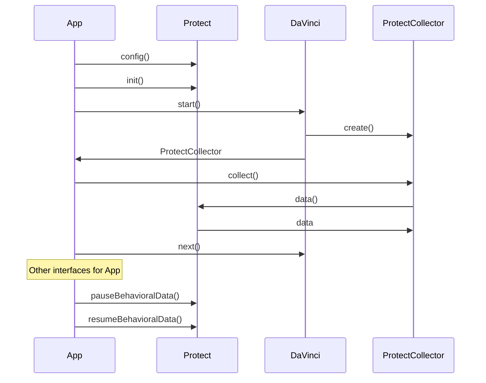
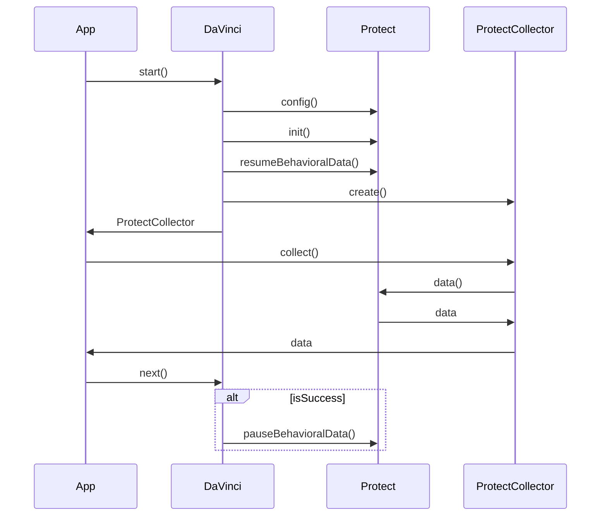
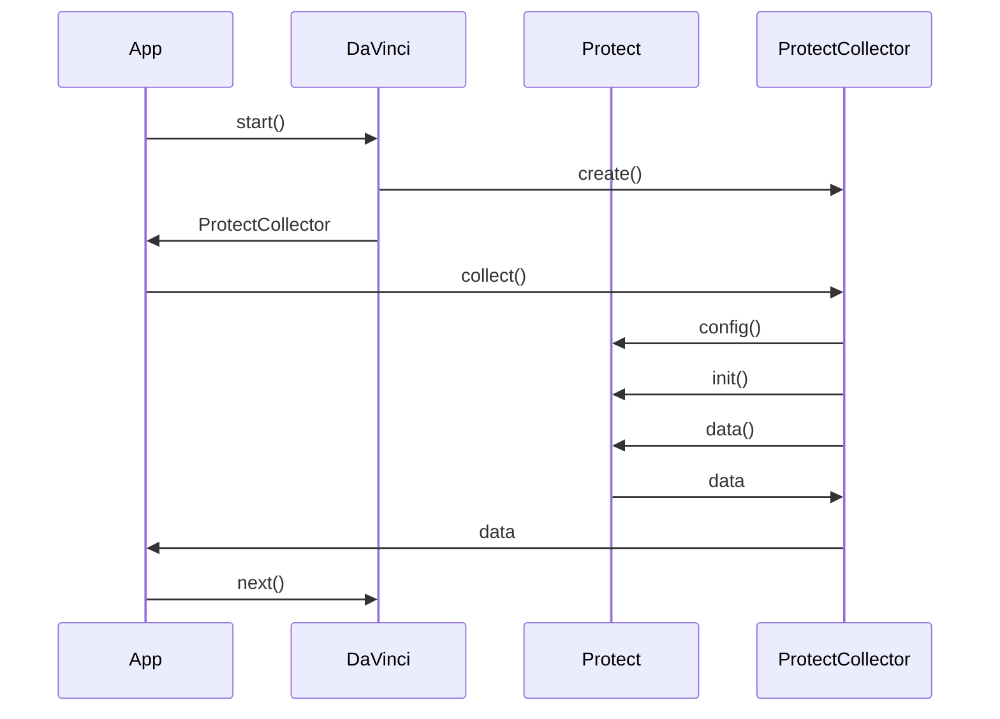

[](https://swift.org)
[](https://developer.apple.com/ios/)
[](../LICENSE)


# PingProtect

> [!NOTE]
> **This module is a wrapper for the standalone PingOne Protect SDK. Its purpose is to facilitate integration between your application and PingOne services, typically as part of a DaVinci flow or an Advanced Identity Cloud/PingAM journey. The Protect service is invoked server-side as a step within the orchestration layer, not directly from the client application. This architecture means that the business logic for triggering PingOne Protect resides on the server, allowing you to update this logic without requiring a new client application release.**
>
> **Alternatively, for scenarios where you need to call the service independently outside of an orchestrated flow, Protect offers a standalone [PingOne Protect SDK](https://developer.pingidentity.com/pingone-api/native-sdks/pingone-risk-sdks/risk_evaluation_sdk_ios.html). This option allows for direct application integration with the specific PingOne service using purpose-built REST APIs.**

## Getting Started

### Prerequisites

- PingOne DaVinci or Ping Advanced Identity Cloud / PingAM [Supported Versions](https://support.pingidentity.com/s/article/Ping-Identity-EOL-Tracker)
- iOS 16.0+
- Swift 6.0+
- Xcode 15+

### Installation

To integrate the module into your iOS project, add the following dependency to your `Package.swift` or `Podfile` file.

> [!NOTE]
> The module name differs depending on the dependency manager. Use **`PingProtect`** for Swift Package Manager (SPM), and **`PingOneProtect`** for CocoaPods.

#### Swift Package Manager

```swift
.package(url: "https://github.com/ForgeRock/ping-ios-sdk.git", from: "<version>")
```

Then add the `PingProtect` product to your target's dependencies.

#### CocoaPods

```ruby
pod 'PingOneProtect', '~> <version>'
```

Replace `<version>` with the latest version of the SDK.

### Import the Module

```swift
import PingProtect
```

## Overview

The `PingProtect` module is a powerful component of the Ping Orchestration SDK for iOS, designed to seamlessly integrate Ping
Identity's Protect service into your mobile applications. It provides comprehensive tools for real-time behavioral data
collection, sophisticated risk analysis, and adaptive authentication strategies. By leveraging this module, developers
can significantly enhance application security, detect and mitigate fraudulent activities, and create a more secure and
user-friendly authentication experience.

## Usage

### DaVinci Integration:

The `ProtectCollector` class, implementing the `Collector` protocol, is a critical component for gathering
behavioral risk data. It enables real-time risk assessment during DaVinci flows.

**Detailed Data Collection Process:**

```swift
node.collectors.forEach { collector in
    switch collector {
    case let protectCollector as ProtectCollector:
        let result = await protectCollector.collect()
        switch result {
        case .success:
            // Data collection successful: Proceed to the next node in the DaVinci flow.
            node.next()
        case .failure:
            // Data collection failed: Implement robust error handling.
            // Example: Log the error, display an informative message, or implement a retry mechanism.
            break
        }
    // ... Handle other collector types (e.g., OidcCollector, etc.)
    default:
        break
    }
}
```

The `collect()` method triggers the risk data collection, returning a `.success` or `.failure` result. Upon
success, `node.next()` advances the DaVinci flow. In case of failure, implement detailed error handling to maintain a
smooth user experience.

**Out of scope**

The PingProtect module's data collection results in a payload size that exceeds the practical limits for URL parameters in a
GET request. Consequently, the data cannot be included during DaVinci's start. Instead, the collect() function is
employed to retrieve the necessary data when required by the flow.

## Journey Integration

The `PingOneProtectInitializeCallback` is a specialized callback designed to initialize the Protect SDK within the
Journey. It ensures that the SDK is properly configured and ready to collect behavioral data during the user journey.
The `PingOneProtectEvaluationCallback` is another callback that collects data from the Protect SDK,
allowing the Journey to collect and utilize risk data for decision-making.

```swift
node.callbacks.forEach { callback in
    switch callback {
    case let protectInitCallback as PingOneProtectInitializeCallback:
        // Initialize the Protect SDK
        let result = await protectInitCallback.start()
        switch result {
        case .success:
            // Initialization successful: Proceed to the next step in the Journey.
            break
        case .failure(let error):
            // Initialization failed: Implement robust error handling.
            print("Protect initialization failed: \(error)")
        }
    case let protectEvalCallback as PingOneProtectEvaluationCallback:
        // Collect risk data from the Protect SDK
        let result = await protectEvalCallback.collect()
        switch result {
        case .success:
            // Data collection successful: Process the collected data.
            break
        case .failure(let error):
            // Data collection failed: Implement robust error handling.
            print("Protect data collection failed: \(error)")
        }
    // ... Handle other callback types
    default:
        break
    }
}
```

## PingProtect SDK Initialization

Proper initialization is crucial for the PingProtect SDK's functionality. The SDK offers multiple initialization methods to
suit various application architectures and requirements.

### Direct Initialization Using the `Protect` Interface: Fine-Grained Control

For maximum control over SDK configuration, use the `Protect` interface directly:

```swift
await Protect.config { protectConfig in
    protectConfig.isBehavioralDataCollection = true // Enable behavioral data collection.
    protectConfig.isLazyMetadata = true // Enable lazy loading of device metadata.
    protectConfig.envId = URL(string: "https://api.pingone.com")?.host // Set the PingOne environment ID.
    protectConfig.deviceAttributesToIgnore = ["deviceId", "androidId", "serialNumber"] // Exclude sensitive device attributes.
    protectConfig.isConsoleLogEnabled = true // Enable detailed console logging for debugging.
}

try await Protect.initialize() // Initialize the Protect SDK with the provided configuration.

print("Protect SDK initialized.")

await Protect.pauseBehavioralData() // Temporarily pause behavioral data collection.
await Protect.resumeBehavioralData() // Resume behavioral data collection.
}
```

**Configuration Parameters Explained:**

* `isBehavioralDataCollection`: Enables or disables the collection of user behavioral data.
* `isLazyMetadata`: Enables lazy loading of device metadata, improving performance by deferring metadata retrieval until
  needed.
* `envId`: Specifies the PingOne environment ID, essential for connecting to your PingOne tenant.
* `deviceAttributesToIgnore`: Provides a list of device attributes to exclude from data collection, enhancing privacy
  and security.
* `customHost`: Allows specifying a custom host for the Protect API, useful in specific deployment scenarios.
* `isConsoleLogEnabled`: Enables detailed console logging, aiding in debugging and troubleshooting.



### Automatic Initialization with the `ProtectLifecycle` Module: Simplified Management

The `ProtectLifecycle` module automates the SDK's lifecycle management, simplifying its integration within DaVinci
flows:

```swift
let davinci = DaVinci.createDaVinci { config in
    config.module(OidcModule.config) { oidcValue in
        oidcValue.clientId = "dummy"
        // ... Other Oidc configurations
    }
    config.module(ProtectLifecycleModule.config) { protectValue in
        protectValue.isBehavioralDataCollection = true // Default: true
        protectValue.isLazyMetadata = true // Default: false
        protectValue.envId = "api.pingone.com" // Default: null
        protectValue.deviceAttributesToIgnore = ["deviceId"] // Default: empty list
        protectValue.customHost = "https://api.pingone.com" // Default: null
        protectValue.isConsoleLogEnabled = true // Default: false
        protectValue.pauseBehavioralDataOnSuccess = true // Pause data collection after successful authentication.
        protectValue.resumeBehavioralDataOnStart = true // Resume data collection on application start.
        
    }
}
```



### Lazy Initialization: On-Demand SDK Activation

The SDK employs lazy initialization, meaning it only activates when triggered by server responses, such as the
instantiation of Collector or Callback objects. This approach conserves resources and accelerates application startup.
However, the initial interaction with the PingProtect SDK might experience a slight delay. Furthermore, if behavioral data
collection is active, the initial lack of SDK activation could result in incomplete data capture, potentially requiring
data collection later in the application flow.



> [!WARNING]
> The Signal SDK, used internally by the Protect SDK, employs a Singleton pattern. This means it can only be initialized
> once. Subsequent `init()` calls are ignored.

### Pause and Resume Behavioral Data Collection: Granular Control

Control behavioral data collection with the following methods:

```swift
await Protect.pauseBehavioralData() // Pause data collection.
await Protect.resumeBehavioralData() // Resume data collection.
```

These methods allow for granular control over data collection, enabling you to pause collection during sensitive
operations or when required by user privacy preferences.

## License

This software may be modified and distributed under the terms of the MIT license. See the LICENSE file for details.

© Copyright 2025-2026 Ping Identity Corporation. All Rights Reserved
