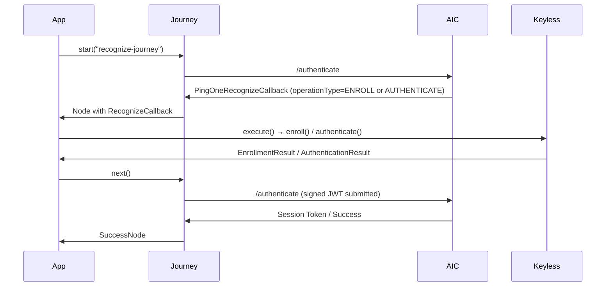

[](https://github.com/ForgeRock/ping-ios-sdk)

# Recognize Module: PingOne Recognize Biometric Authentication

## Overview

The `PingRecognize` module integrates [PingOne Recognize](https://docs.pingidentity.com/pingoneaic/latest/) (powered by the Keyless biometric SDK) into Journey-based authentication flows on iOS. It handles both **enrollment** (registering a user's biometric) and **authentication** (verifying a returning user) through standard Journey callbacks.

The module exposes a single callback returned automatically by the Journey framework, which handles both operations based on the `operationType` field:

| `operationType` | Purpose                           |
|-----------------|-----------------------------------|
| `ENROLL`        | Biometric enrollment ceremony     |
| `AUTHENTICATE`  | Biometric authentication ceremony |

All server-supplied configuration fields (API key, host, transaction data, liveness settings, etc.) are parsed automatically from the Journey response — **you only need to call `execute()`**.



---

## Requirements

- iOS 16.0+
- Swift 6.0+

---

## Installation

### Swift Package Manager

```swift
.product(name: "PingRecognize", package: "ping-ios-sdk")
```

### CocoaPods

```ruby
pod 'PingRecognize', '~> 2.0.0'
pod 'PingJourney',   '~> 2.0.0'
```

---

## Prerequisites: AIC Journey Configuration

Before writing any iOS code, configure a Journey in AIC that includes a **PingOne Recognize** node. The node produces a `PingOneRecognizeCallback` with either `operationType = "ENROLL"` or `operationType = "AUTHENTICATE"` depending on the flow.

The node also provides all SDK parameters (API key, host, liveness configuration, etc.) as output fields — the SDK maps these to the Keyless `BiomEnrollConfig` / `BiomAuthConfig` automatically.

---

## Getting Started

### 1. Register the Callback

Register `RecognizeCallback` before starting any Journey:

```swift
await RecognizeCallbacks.registerCallbacks()
```

### 2. Create a Journey Instance

```swift
let journey = await Journey.createJourney { config in
    config.module(Oidc) { oidcConfig in
        oidcConfig.clientId = "your-client-id"
        oidcConfig.discoveryEndpoint = "https://openam-your-tenant.forgeblocks.com/am/oauth2/alpha/.well-known/openid-configuration"
        oidcConfig.scopes = ["openid", "profile", "email"]
        oidcConfig.redirectUri = "com.example.app://oauth2redirect"
    }
}
```

### 3. Handle the Recognize Callback

```swift
for await node in journey.start() {
    switch node {
    case let continueNode as ContinueNode:
        for callback in continueNode.callbacks {
            if let recognizeCallback = callback as? RecognizeCallback {
                let result = await recognizeCallback.execute()
                switch result {
                case .success:
                    await continueNode.next()
                case .failure(let error):
                    print("Recognize failed: \(error.localizedDescription)")
                }
            }
        }
    case is SuccessNode:
        print("User authenticated")
    case is FailureNode:
        print("Authentication failed")
    default:
        break
    }
}
```

---

## Enrollment

`RecognizeCallback.execute()` detects `operationType == .enroll` and performs the full biometric enrollment ceremony via `Keyless.enroll(configuration:)`.

The callback automatically maps every server-supplied field to `BiomEnrollConfig`:

| Callback / `mobileSDKOptions` field              | `BiomEnrollConfig` property           |
|--------------------------------------------------|---------------------------------------|
| `transactionData`                                | `jwtSigningInfo`                      |
| `clientState`                                    | `clientState`                         |
| `generateClientState`                            | `generatingClientState`               |
| `mobileSDKOptions.livenessConfiguration`         | `livenessConfiguration`               |
| `mobileSDKOptions.livenessEnvironmentAware`      | `livenessEnvironmentAware`            |
| `mobileSDKOptions.operationInfoId`               | `operationInfo.id`                    |
| `mobileSDKOptions.operationInfoPayload`          | `operationInfo.payload`               |
| `mobileSDKOptions.operationInfoExternalUserId`   | `operationInfo.externalUserId`        |
| `mobileSDKOptions.cameraDelaySeconds`            | `cameraDelaySeconds`                  |
| `mobileSDKOptions.customSecret`                  | `customSecret`                        |
| `mobileSDKOptions.shouldRetrieveEnrollmentFrame` | `shouldRetrieveEnrollmentFrame`       |
| `mobileSDKOptions.showSuccessFeedback`           | `showSuccessFeedback`                 |
| `mobileSDKOptions.showFailureFeedback`           | `showFailureFeedback`                 |
| `mobileSDKOptions.showInstructionsScreen`        | `showInstructionsScreen`              |

On success, `IDToken1keylessId`, `IDToken1signedJwt`, and `IDToken1clientState` are automatically populated and submitted to the server.

---

## Authentication

`RecognizeCallback.execute()` detects `operationType == .authenticate` and performs the full biometric authentication ceremony via `Keyless.authenticate(configuration:)`.

The callback automatically maps server-supplied fields to `BiomAuthConfig`:

| Callback / `mobileSDKOptions` field                  | `BiomAuthConfig` property             |
|------------------------------------------------------|---------------------------------------|
| `transactionData`                                    | `jwtSigningInfo`                      |
| `generateClientState`                                | `generatingClientState`               |
| `mobileSDKOptions.livenessConfiguration`             | `livenessConfiguration`               |
| `mobileSDKOptions.livenessEnvironmentAware`          | `livenessEnvironmentAware`            |
| `mobileSDKOptions.operationInfoId`                   | `operationInfo.id`                    |
| `mobileSDKOptions.operationInfoPayload`              | `operationInfo.payload`               |
| `mobileSDKOptions.operationInfoExternalUserId`       | `operationInfo.externalUserId`        |
| `mobileSDKOptions.cameraDelaySeconds`                | `cameraDelaySeconds`                  |
| `mobileSDKOptions.showSuccessFeedback`               | `showSuccessFeedback`                 |
| `mobileSDKOptions.shouldRetrieveAuthenticationFrame` | `shouldRetrieveAuthenticationFrame`   |
| `mobileSDKOptions.shouldRemovePin`                   | `shouldRemovePin`                     |
| `mobileSDKOptions.presentationStyle`                 | `presentationStyle`                   |

On success, `IDToken1signedJwt` and `IDToken1clientState` are automatically submitted.

---

## Complete Example (SwiftUI ViewModel)

```swift
@MainActor
class RecognizeViewModel: ObservableObject {
    @Published var state: RecognizeState = .idle

    private var journey: Journey?

    func setup() async {
        await RecognizeCallbacks.registerCallbacks()
        journey = await Journey.createJourney { config in
            config.module(Oidc) { oidcConfig in
                oidcConfig.clientId = "your-client-id"
                oidcConfig.discoveryEndpoint = "https://openam-your-tenant.forgeblocks.com/am/oauth2/alpha/.well-known/openid-configuration"
                oidcConfig.scopes = ["openid", "profile"]
                oidcConfig.redirectUri = "com.example.app://oauth2redirect"
            }
        }
    }

    func start() async {
        guard let journey else { return }
        for await node in journey.start() {
            await handleNode(node)
        }
    }

    private func handleNode(_ node: Node) async {
        switch node {
        case let continueNode as ContinueNode:
            for callback in continueNode.callbacks {
                if let recognizeCallback = callback as? RecognizeCallback {
                    state = recognizeCallback.operationType == .enroll ? .enrolling : .authenticating
                    let result = await recognizeCallback.execute()
                    switch result {
                    case .success:
                        await continueNode.next()
                    case .failure(let error):
                        state = .error(error.localizedDescription)
                    }
                }
            }
        case is SuccessNode:
            state = .success
        case is FailureNode:
            state = .error("Journey failed")
        default:
            break
        }
    }
}

enum RecognizeState {
    case idle, enrolling, authenticating, success
    case error(String)
}
```

---

## Troubleshooting

| Symptom | Possible Cause | Fix |
|---------|----------------|-----|
| `Keyless.configure` callback returns an error | Wrong API key or host URL | Verify the values returned by the Journey node output fields |
| Camera never opens | Missing active `UIViewController` context | Ensure `execute()` is called from the main thread with an active view controller in the hierarchy |
| `"operationType" is required` error | Journey node misconfigured | Check the PingOne Recognize node configuration in AIC |
| Journey returns an error after biometric success | Double submission | `execute()` submits inputs automatically — do **not** call `input()` manually again |
| Liveness check too strict / too lenient | Server default not suitable | Check the liveness configuration in the AIC node settings |

---

## License

This project is licensed under the MIT license. See the [LICENSE](../LICENSE) file for details.
